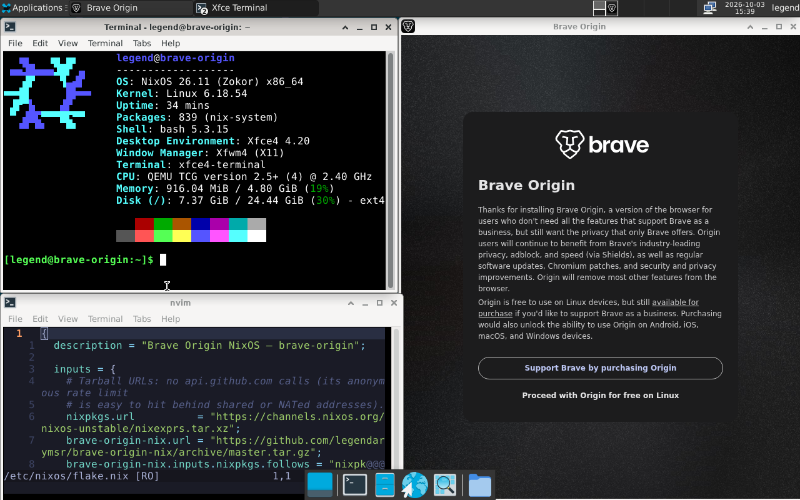

# brave-origin-nix

Brave Origin (nightly) browser packaged as a Nix flake.



> The README is also available as a `.nix` file because everything is a `.nix` file.

---

## Updating

Bump to the latest nightly version:

```bash
nix run .#update
```

Finds the latest release, downloads it, recomputes the hash, and patches `pkgs/brave-origin.nix`. Then commit and push.

---

## Run without installing

```bash
nix run github:legendarymsr/brave-origin-nix --no-write-lock-file --refresh
```

---

## home-manager

In your flake inputs:

```nix
inputs.brave-origin.url = "github:legendarymsr/brave-origin-nix";
```

In your home-manager configuration:

```nix
imports = [ inputs.brave-origin.homeModules.brave-origin ];

programs.brave-origin-nightly = {
  enable          = true;
  defaultBrowser  = true;                              # optional
  extensions      = [ "cjpalhdlnbpafiamejdnhcphjbkeiagm" ]; # optional — CWS ID
  commandLineArgs = [ "--force-dark-mode" ];           # optional
};
```

> **Breaking change:** the home-manager options moved from `programs.brave-origin.*` to
> `programs.brave-origin-nightly.*`. home-manager now ships its own `programs.brave-origin`
> (Chromium-family module), and the two collided with
> `The option 'programs.brave-origin.enable' ... is already declared`.
> Migration: rename `programs.brave-origin` → `programs.brave-origin-nightly` in your
> home-manager config. The NixOS option `programs.brave-origin.enable` is unchanged.
>
> `homeManagerModules` is kept as an alias of `homeModules`.

### Options

| Option | Type | Default | Description |
|---|---|---|---|
| `enable` | bool | `false` | Install brave-origin |
| `defaultBrowser` | bool | `false` | Set as default browser for http/https/HTML |
| `extensions` | list of strings | `[]` | Chrome Web Store extension IDs to install (via "External Extensions"; user-removable) |
| `commandLineArgs` | list of strings | `[]` | Extra flags passed to the browser on startup |

---

## NixOS

```nix
inputs.brave-origin.url = "github:legendarymsr/brave-origin-nix";

imports = [ inputs.brave-origin.nixosModules.brave-origin ];
programs.brave-origin.enable = true;
```

The NixOS module sets up the `chrome-sandbox` setuid wrapper automatically via `security.wrappers`.

---

## XFCE

The point of this flake is Brave Origin. XFCE is here purely so you don't have to mess with multiple flakes. Stock XFCE, stays out of the way. If you already have a desktop just ignore this.

### Keybindings

| Shortcut | Action |
|---|---|
| `Super + B` | Launch Brave Origin |
| `Super + T` | Terminal |
| `Super + E` | File manager (Thunar) |
| `Super + D` | Desktop menu |
| `Super + Escape` | Lock screen |
| `Super + H/L` | Tile window left/right |
| `Super + K` | Maximise |
| `Super + J` | Minimise |
| `Super + Tab` | Cycle windows |
| `Super + Shift + H/L` | Move to prev/next workspace |
| `Print` | Screenshot |

### One flake, one `nixos-rebuild switch`

Browser + desktop + editor, nothing else needed:

```nix
{
  inputs = {
    nixpkgs.url      = "github:nixos/nixpkgs/nixos-unstable";
    home-manager.url = "github:nix-community/home-manager";
    brave-origin.url = "github:legendarymsr/brave-origin-nix";
    # nixvim is re-exported by brave-origin — no extra input needed
  };

  outputs = { nixpkgs, home-manager, brave-origin, ... }: {
    nixosConfigurations.mymachine = nixpkgs.lib.nixosSystem {
      system = "x86_64-linux";
      modules = [
        ./hardware-configuration.nix
        brave-origin.nixosModules.brave-origin
        brave-origin.nixosModules.xfce
        home-manager.nixosModules.home-manager
        {
          programs.brave-origin.enable = true;
          desktop.xfce.enable          = true;

          home-manager.users.youruser = {
            imports = [
              brave-origin.homeModules.brave-origin
              brave-origin.homeModules.xfce
              brave-origin.homeModules.nixvim
            ];
            programs.brave-origin-nightly.enable         = true;
            programs.brave-origin-nightly.defaultBrowser = true;
            desktop.xfce.enable                          = true;
            programs.nixvim-simple.enable                = true;
            home.stateVersion                            = "24.11";
          };
        }
      ];
    };
  };
}
```

---

## Sandboxing

The NixOS module handles `chrome-sandbox` automatically via `security.wrappers`.

For standalone `nix run` (no NixOS module), the launcher never escalates privileges itself: if
`/run/wrappers/bin/chrome-sandbox` is missing it prints a warning to stderr and starts with
`--no-sandbox`.

Manual setup on non-NixOS-module systems (`/run` is a tmpfs, so repeat after each reboot):

```bash
sudo install -D -m 4755 -o root -g root \
  "$(nix build github:legendarymsr/brave-origin-nix --no-link --print-out-paths)/libexec/brave-origin-nightly/chrome-sandbox" \
  /run/wrappers/bin/chrome-sandbox
```

---

## Text editor

Minimal nixvim — no extra flake input needed, re-exported by this flake:

```nix
imports = [ inputs.brave-origin.homeModules.nixvim ];
programs.nixvim-simple.enable = true;
```

**Features:** relative numbers · nixd (Nix LSP)
